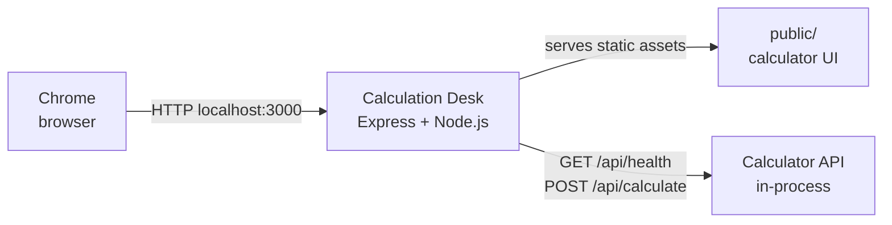

# Azure Debug Plan

> This plan is the source of truth for generating the VS Code debug setup in this workspace.
>
> **Status:** Implemented
> **Execution Mode:** Guided
> **Created:** 2026-09-30T00:00:00Z
> **Last Updated:** 2026-09-29T20:49:34Z

## Prerequisites

| Tool / Extension | Category | Service(s) | Installed | Version |
|------------------|----------|------------|-----------|---------|
| Node.js | Runtime | `calculator-api` | ✅ | 22.18.0 |
| npm | Package manager | `calculator-api` | ✅ | 10.9.3 |
| Chrome | Browser | `calculator-api` | ✅ | 154.0.8037.58 |

No Azure-specific VS Code extension, container runtime, or Compose provider is required: this service has no Azure dependency that needs a local emulator.

## Debug Configurations

| Generate | Debug Config Name | Service Label | Service Root | Project Type | Runtime | Version | Azure Dependencies |
|----------|--------------------|---------------|--------------|--------------|---------|---------|---------------------|
| [x] | Calculation Desk (debug) | Calculation Desk | `.` | app-service | node-js | `>=18` (detected 22.18.0) | — |

Project Type Descriptions

| Project Type | Description |
|-------------|-------------|
| app-service | HTTP server application using Express that serves the browser assets and API routes. |

## Orchestrator

No container orchestration is required for this stateless Node.js service.

| Orchestrator | Container Runtime | Compose Command | Description |
|-------------|-------------------|-----------------|-------------|
| Not applicable | — | — | No Azure emulators or dependent containers are needed. |

## Emulators

No emulators are required. The calculator evaluates expressions in process and does not use a database or external Azure service.

## Architecture Diagram

During debugging, Chrome connects to the Express process, which serves the static calculator UI and handles the calculator API in the same Node.js service.

## API Test Collections

| Generate | Service | Description |
|----------|---------|-------------|
| [x] | Calculation Desk | 

HTTP Endpoints (4)
 GET / GET /api/health GET /api/openapi.json POST /api/calculate  
 |

### GET / `http-root`

### GET /api/health `http-health`

### GET /api/openapi.json `http-openapi`

### POST /api/calculate `http-calculate`

## Convenience Scripts

| Generate | Script | Registered In | Description |
|----------|--------|---------------|-------------|
| [x] | dev | `./package.json` | Start the Express server with automatic restart on source changes. |
| [x] | test | `./package.json` | Run the Jest and Supertest test suite serially. |

⚠️ LIMITED SUPPORT: Project type "app-service" is not yet fully supported. Generated artifacts use the available Node.js runtime conventions and were validated against the Express service.

## Debug Configuration Checklist

Debug Configuration Checklist:
✅ Calculation Desk (debug) — Node Inspector ready on `9229`, application ready at `http://localhost:3000`, HTTP `/` returned 200, inspector `/json/list` returned 200, and validation ports were released during teardown.